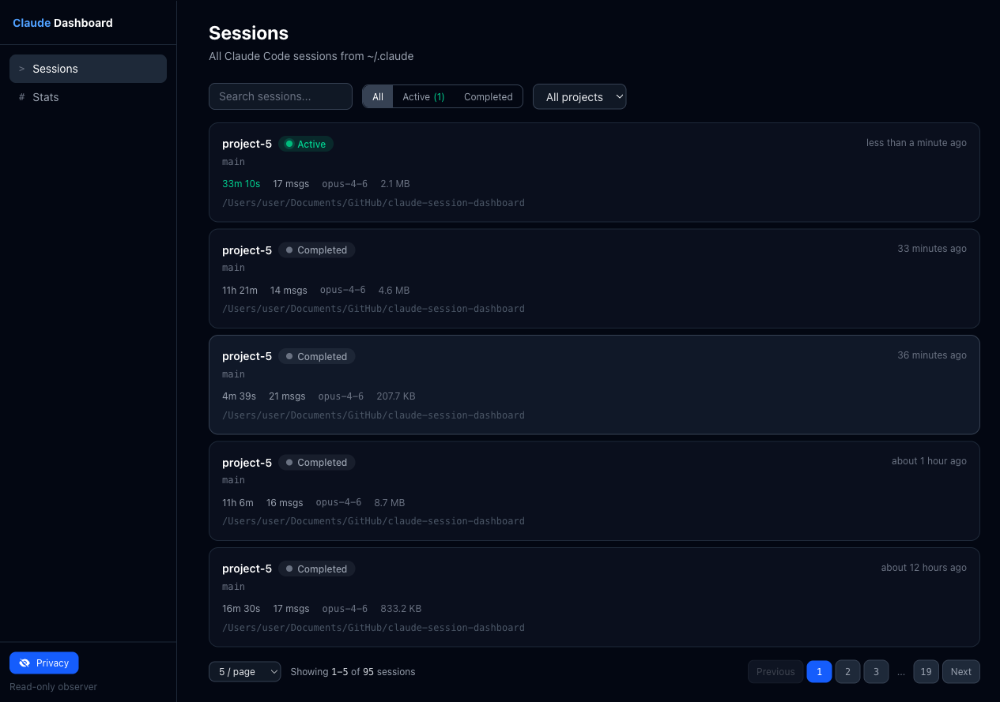
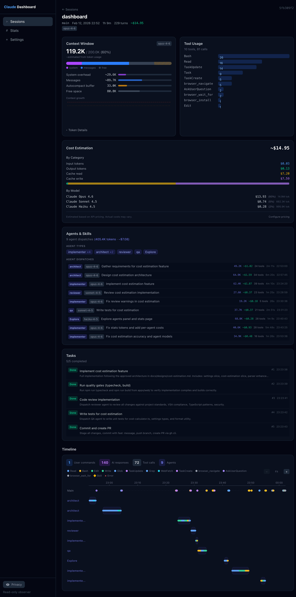

# Claude Session Dashboard

A read-only, local observability dashboard for [Claude Code](https://docs.anthropic.com/en/docs/claude-code) sessions. Scans your `~/.claude` directory to visualize session details, tool usage, agent dispatches, token consumption, and execution timelines.



## Why?

Claude Code stores session data locally in `~/.claude/projects/`, but there's no built-in way to browse, search, or analyze past sessions. This dashboard gives you visibility into:

- How long sessions run and how many tokens they consume
- Which tools and agents are used most frequently
- Timeline visualization of tool calls and agent dispatches
- Context window utilization and growth patterns
- Active vs completed session status

## Features

- **Sessions list** with search, status filters, project filters, and pagination
- **Session detail** with context window breakdown, tool usage stats, agent dispatch history
- **Timeline chart** showing tool calls, agent runs, and skill invocations on a Gantt-style timeline with zoom controls
- **Stats page** with aggregate metrics across all sessions
- **Live updates** — active sessions refresh automatically (3s polling for status, 30s for full data)
- **Privacy mode** — toggle to anonymize paths and usernames for safe screenshot sharing



## Quick Start

```bash
# Clone the repo
git clone https://github.com/DimaLupyak/claude-session-dashboard.git
cd claude-session-dashboard/apps/web

# Install dependencies
npm install

# Start the dev server
npm run dev
```

Open [http://localhost:3000](http://localhost:3000) in your browser.

> **Note:** The dashboard runs entirely on localhost and only reads files from `~/.claude`. It never modifies any Claude Code data.

## Tech Stack

- [TanStack Start](https://tanstack.com/start) — SSR framework on Vite
- [TanStack Router](https://tanstack.com/router) — file-based routing with type-safe search params
- [TanStack Query](https://tanstack.com/query) — data fetching with automatic refetch
- [Tailwind CSS v4](https://tailwindcss.com/) — utility-first styling
- [Recharts](https://recharts.org/) — charting library for timeline and stats
- [Zod](https://zod.dev/) — runtime validation for server functions and URL params

## Project Structure

```
apps/web/src/
  routes/                    # File-based routes (TanStack Router)
    _dashboard/
      sessions/
        index.tsx            # Sessions list page
        $sessionId.tsx       # Session detail page
      stats/
        index.tsx            # Aggregate stats page
  features/                  # Vertical Slice Architecture
    sessions/                # Sessions list feature
    session-detail/          # Session detail feature
    stats/                   # Stats feature
  lib/
    scanner/                 # Filesystem scanner for ~/.claude
    parsers/                 # JSONL session file parsers
    utils/                   # Shared utilities
```

## How It Works

1. **Scanning** — The server reads `~/.claude/projects/` to discover all session `.jsonl` files. An mtime-based cache avoids re-parsing unchanged files.
2. **Parsing** — Session files are parsed to extract metadata (project, branch, duration, model), tool calls, agent dispatches, token usage, and errors.
3. **Server Functions** — TanStack Start server functions expose parsed data to the client via type-safe RPC.
4. **React Query** — The UI fetches data through React Query with automatic background refetch for live updates.

## Development

```bash
cd apps/web

npm run dev          # Dev server on localhost:3000
npm run build        # Production build
npm run typecheck    # TypeScript type checking
npm run test         # Run tests (Vitest)
```

## License

MIT
