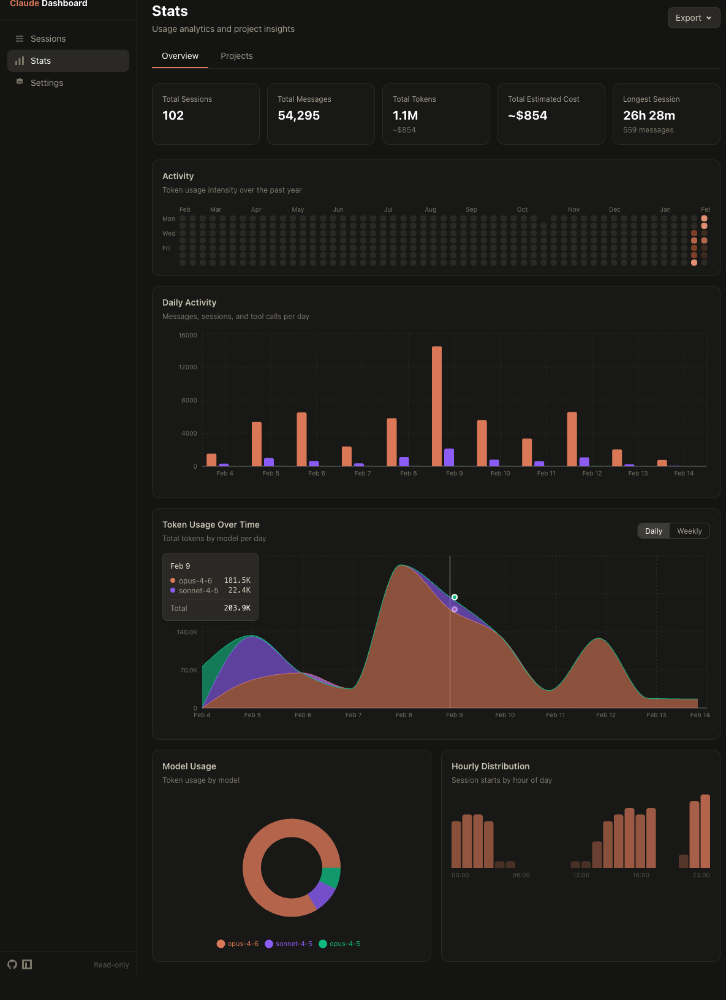

# Claude Session Dashboard

A read-only, local observability dashboard for [Claude Code](https://docs.anthropic.com/en/docs/claude-code) sessions. Scans your `~/.claude` directory to visualize session history, tool usage, token consumption, cost estimates, and activity trends -- all without sending data anywhere.


## Why?

Claude Code stores all session data locally in `~/.claude/projects/`, but there is no built-in way to browse, search, or analyze past sessions. As you accumulate hundreds of sessions across dozens of projects, questions start piling up:

- How many tokens did that refactoring session actually use?
- Which tools does Claude call most often in my codebase?
- How much am I spending per project, per day, per model?
- Is the context window filling up mid-session?
- When am I most active -- mornings or late nights?

This dashboard gives you answers. It reads your local session files, parses the JSONL logs, and presents everything in a fast, searchable web UI that runs entirely on your machine.

## Features

**Session browsing and search**
- Full-text search across session names, projects, and branches
- Filter by status (active / completed), project, model, and date range
- Sortable columns with pagination
- Active session indicator with real-time status polling

**Session detail view**
- Context window utilization breakdown (input, output, cache read, cache creation)
- Tool usage frequency and duration statistics
- Agent dispatch history with nested tool calls
- Gantt-style timeline chart with zoom controls for tool calls, agent runs, and skill invocations
- Per-session and per-agent cost estimates with per-model and per-category breakdowns


**Analytics and stats**
- GitHub-style contribution heatmap showing token usage intensity over the past year
- Token usage over time -- stacked area chart with daily/weekly toggle, top 5 models + "Other"
- Model usage distribution across all sessions
- Hourly activity distribution chart
- Aggregate metrics: total sessions, messages, tokens, estimated cost



**Per-project analytics**
- Dedicated "Projects" tab with sortable table
- Sessions, messages, tokens, and duration aggregated per project
- Drill-down links to filtered session lists


**Cost estimation**
- Configurable API pricing per model (Claude Sonnet 4, Opus 4, Haiku, etc.)
- Subscription tier support (Free, Pro, Max 5x/20x) with appropriate rate adjustments
- Settings persisted to `~/.claude-dashboard/settings.json`


**Data export**
- Export stats and session data in CSV or JSON format
- Four export formats: session summaries, model usage, daily activity, project analytics
- Client-side export -- no server round-trip needed

**Real-time monitoring**
- Active sessions badge in the sidebar with 3-second status polling
- Active session banner on detail pages with adaptive refresh intervals
- Automatic data refresh for in-progress sessions

**Privacy mode**
- Toggle to anonymize project names, file paths, branch names, and usernames
- Analytics data anonymized consistently across all views
- Safe for screenshot sharing and presentations

## Quick Start

### Using npx (recommended)

```bash
npx claude-session-dashboard
```

### Using npm (global install)

```bash
npm install -g claude-session-dashboard
claude-dashboard
```

### Using Docker

```bash
docker run -v ~/.claude:/home/node/.claude:ro -p 3000:3000 ghcr.io/dlupiak/claude-session-dashboard
```

Or with Docker Compose:

```bash
git clone https://github.com/dlupiak/claude-session-dashboard.git
cd claude-session-dashboard
docker compose up
```

### From source

```bash
git clone https://github.com/dlupiak/claude-session-dashboard.git
cd claude-session-dashboard/apps/web
npm install
npm run build
npm start
```

Open [http://localhost:3000](http://localhost:3000) in your browser.

## CLI Options

```
  -p, --port <number>   Port to listen on (default: 3000)
  --host <hostname>     Host to bind to (default: localhost)
  -o, --open            Open browser after starting
  -v, --version         Show version number
  -h, --help            Show this help message
```

> **Note:** The dashboard runs entirely on localhost and only reads files from `~/.claude`. It never modifies any Claude Code data and never sends data over the network.

## Tech Stack

- [TanStack Start](https://tanstack.com/start) -- SSR framework on Vite
- [TanStack Router](https://tanstack.com/router) -- file-based routing with type-safe search params
- [TanStack Query](https://tanstack.com/query) -- data fetching with caching and automatic background refetch
- [Tailwind CSS v4](https://tailwindcss.com/) -- utility-first styling with CSS-first configuration
- [Recharts](https://recharts.org/) -- composable charting library for timeline, heatmap, and stats visualizations
- [Zod](https://zod.dev/) -- runtime validation for server functions and URL params
- Node.js >= 18

## Project Structure

```
apps/web/src/
  routes/                        # File-based routes (TanStack Router)
    _dashboard/
      sessions/
        index.tsx                # Sessions list page
        $sessionId.tsx           # Session detail page
      stats.tsx                  # Stats + per-project analytics page
      settings.tsx               # Settings page
  features/                      # Vertical Slice Architecture
    sessions/                    # Session list, filters, active badge
    session-detail/              # Session detail, timeline, context window
    stats/                       # Activity chart, heatmap, token trends, model usage
    project-analytics/           # Per-project aggregated metrics
    cost-estimation/             # Cost calculation and display
    settings/                    # Subscription tier, pricing editor
    privacy/                     # Privacy mode toggle and anonymization
  lib/
    scanner/                     # Filesystem scanner for ~/.claude
    parsers/                     # JSONL session file parsers
    cache/                       # Persistent disk cache (heatmap data)
    utils/                       # Formatting, export utilities
  components/                    # Shared UI components (ExportDropdown, etc.)
```

## How It Works

1. **Scanning** -- The server reads `~/.claude/projects/` to discover all session `.jsonl` files. An mtime-based cache avoids re-parsing unchanged files.
2. **Parsing** -- Session files are parsed to extract metadata (project, branch, duration, model), tool calls, agent dispatches, token usage, and errors.
3. **Server Functions** -- TanStack Start server functions (`createServerFn`) expose parsed data to the client via type-safe RPC. All file I/O stays on the server.
4. **React Query** -- The UI fetches data through React Query with automatic background refetch for live updates. Active sessions use adaptive polling intervals.
5. **Caching** -- Parsed session summaries and heatmap data are cached in memory (mtime-based invalidation) and on disk (`~/.claude-dashboard/cache/`) for fast startup.

## Development

```bash
cd apps/web

npm run dev          # Dev server on localhost:3000
npm run build        # Production build
npm run typecheck    # TypeScript type checking
npm run lint         # ESLint
npm run test         # Unit tests (Vitest)
npm run e2e          # End-to-end tests (Playwright)
```

## Links

- [GitHub](https://github.com/dlupiak/claude-session-dashboard)
- [npm](https://www.npmjs.com/package/claude-session-dashboard)
- [Docker](https://github.com/dlupiak/claude-session-dashboard/pkgs/container/claude-session-dashboard)
- [Issues](https://github.com/dlupiak/claude-session-dashboard/issues)

## License

MIT
